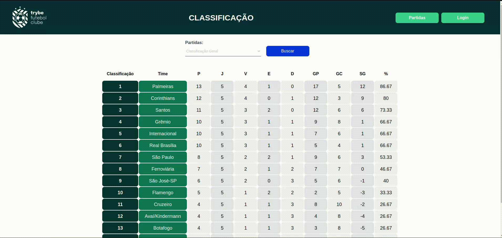

<h1 align="center">🏟️  Football Leaderboard  🏟️</h1>

<div align='center'>

</div>

## Description
<p>building</p>

## 💻 Tecnologies used
> [![Typescript][Typescript]][Typescript-url]
[![Node.js][Node.js]][Node.js-url]
[![EXPRESS][EXPRESS]][EXPRESS-url]
[![DOCKER][DOCKER]][DOCKER-url]
[![MYSQL][MYSQL]][MYSQL-url]
[![Mocha][Mocha]][Mocha-url]
[![Chai][Chai]][Chai-url]
[![OOP][OOP]][OOP-url]

## 🛠️ Instructions

### Notes
>The frontend run in port 3000.<br/>
>The backend run in port 3001.<br/>

### 📚 Requirements to run this project:
- Git.
- NPM - v >= 7.0
- Docker


<details>
    <summary><strong>🐳 Run with Docker 🐳</strong></summary>
    
```bash
# Clone the repo
git clone https://github.com/caiobacode/footbal-leaderboard.git

# Enter in repo
cd footbal-leaderboard

#install dependencies
npm run install:apps

# Run DockerCompose
npm run compose:up

# Go to the backend folder and populate the database.
cd app/backend
npm run db:reset
```
</details>

### <strong>🧪 Test the Back End</strong>

```bash
# enter in backend folder
cd app/backend

# run tests
npm run test
```

## 🔎 Additional details


<details>
    <summary><strong>🌐 API routes</strong></summary>

<br/>

> <strong>Leaderboard Route</strong><br/>
- GET "/leaderboard/home" - Return the leaderboard of the teams that played at home.
- GET "/leaderboard/away" - Return the leaderboard of the teams that not played at home.
- GET "/leaderboard" - Returns the both leaderboard.

> <strong>Login Route</strong><br/>
- POST "/login" - Login the user if the fields are correct.<br/>
- GET "/login/role" - Return the user role(admin or user).

> <strong>Matches Route</strong><br/>
- GET "/matches" - Returns all motorcycles<br/>
- PATCH "/matches/:id/finish" - Finish the match.<br/>
- PATCH "/matches/:id" - Update the match score.<br/>
- POST "/matches" - Start a match with the teams passed by request.

> <strong>Teams Route</strong><br/>
- GET "/teams" - Returns all teams.<br/>
- GET "/teams/:id" - Returns the team that has the id passed by the request.

</details>

  <!-- <details>
    <summary><strong>✏️ What i learned</strong></summary>

+ Object-Oriented APIs
+ ODM (Object-Document Mapping)
+ NoSQL database
+ How to do database queries using mongoose
  
  </details> -->


[Typescript]: https://img.shields.io/badge/typescript-3178C6?style=for-the-badge&logo=typescript&logoColor=white
[Typescript-url]: https://www.typescriptlang.org

[Node.js]: https://img.shields.io/badge/-Node.js-80BC02?style=for-the-badge&logo=node.js&logoColor=black
[Node.js-url]: https://nodejs.org/en

[EXPRESS]: https://img.shields.io/badge/Express-111111?style=for-the-badge&logo=express&logoColor=white
[EXPRESS-url]: https://expressjs.com

[Mocha]: https://img.shields.io/badge/MOCHA-6D4A31?style=for-the-badge&logo=mocha&logoColor=white
[Mocha-url]: https://mochajs.org

[Chai]: https://img.shields.io/badge/chai-974942?style=for-the-badge&logo=chai&logoColor=white
[Chai-url]: https://www.chaijs.com

[MYSQL]: https://img.shields.io/badge/MySQL-00758f?style=for-the-badge&logo=mysql&logoColor=white
[MYSQL-url]: https://www.mysql.com

[DOCKER]: https://img.shields.io/badge/Docker-0db7ed?style=for-the-badge&logo=docker&logoColor=white
[DOCKER-url]: https://www.docker.com

[OOP]: https://img.shields.io/badge/OOP-3a0ca3?style=for-the-badge
[OOP-url]: https://developer.mozilla.org/en-US/docs/Learn/JavaScript/Objects/Object-oriented_programming